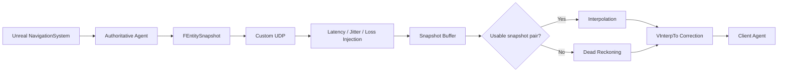

# Realtime-Consistency-Sim

### Networked State Reconstruction Under Latency, Jitter, and Packet Loss


A simulation project for studying how a client can reconstruct a moving agent's state when authoritative updates arrive through an unreliable network.

The project intentionally disables Unreal's built-in actor replication for the simulated agent and implements its own UDP transport, latency/loss injection, snapshot buffering, interpolation, constant-velocity dead reckoning, smooth correction, and CSV experiment logging.

> **Focus:** real-time networking, state reconstruction, simulation, telemetry  
> **Core stack:** Unreal Engine 5 · C++ · UDP sockets · Python/Pandas/Matplotlib for analysis

## Research Report

A longer write-up of the design and experiments is included in the repository:

[**Read the Research Report (PDF)**](./Docs/Research_Report.pdf)

---

## What the System Does

The project runs the same agent in two conceptual roles:

- **Server / authoritative simulation**
  - Generates a path with Unreal's `NavigationSystem`.
  - Moves the authoritative agent along the path.
  - Broadcasts position, velocity, and server timestamp snapshots over UDP.

- **Client / reconstructed simulation**
  - Receives snapshots through a non-blocking UDP socket.
  - Applies configurable artificial latency, jitter, and packet loss.
  - Buffers timestamped snapshots.
  - Interpolates when a usable snapshot pair is available.
  - Falls back to constant-velocity dead reckoning when the interpolation gap is too large.
  - Smoothly moves toward the reconstructed position instead of snapping directly.



---

## Network Protocol

The project uses a small packed binary packet representation.

```cpp
struct FPacketHeader
{
    EPacketType Type;
    int32 Size;
};

struct FEntitySnapshot
{
    FPacketHeader Header;
    FVector Position;
    FVector Velocity;
    float ServerTimestamp;
};
```

Current packet types include:

| Type | Purpose |
|---|---|
| `DUMMY` | Registers a client address with the server |
| `SNAPSHOT` | Transfers authoritative position, velocity, and timestamp |
| `INPUT` | Declared in the protocol for future use |

The socket layer uses Unreal's `FUdpSocketBuilder` in **non-blocking** mode. The server tracks client addresses and broadcasts snapshots with `SendTo`, while clients receive data with `RecvFrom`.

---

## Server-Side Simulation

`AANetworkManager::RunServerSimulation()` drives the authoritative agent.

The current implementation:

1. Requests a random navigable target around the agent.
2. Uses `UNavigationSystemV1::FindPathToLocationSynchronously(...)`.
3. Stores the returned path points.
4. Moves toward the current path point at a fixed simulated speed.
5. Projects movement back onto the navigation surface.
6. Broadcasts a new `FEntitySnapshot` every simulation tick.

This project therefore uses **Unreal NavigationSystem-based path generation**. It does **not** implement a custom A* planner.

If repeated path generation fails, `ForceUnstuckAgent()` resets the agent to the map center and clears path state.

---

## Network Impairment Simulation

Network degradation is applied after a snapshot is received by the client-side network manager.

### Packet Loss

A snapshot is dropped when:

```text
random(0, 1) < SimulatedPacketLoss
```

### Latency and Jitter

Accepted snapshots are placed into a delayed-packet queue.

The current delay model is:

```text
process_time = current_time + latency + jitter
jitter ∈ [-0.2 × latency, +0.2 × latency]
```

This allows the experiment to reproduce irregular packet arrival without relying on Unreal's replication system.

---

## Client-Side State Reconstruction

The main reconstruction logic lives in `ANetworkAgent::Tick()`.

### 1. Initial Time Offset

When the first valid snapshot arrives, the client estimates a server/client clock offset:

```text
ClientServerTimeDelta = ServerTimestamp - CurrentClientTime
```

The render target time is then:

```text
RenderTime = EstimatedServerTime - InterpolationDelay
```

The current source uses:

```text
InterpolationDelay = 0.7 seconds
```

This deliberately renders behind the latest estimated server time so that multiple snapshots are more likely to be available for interpolation.

### 2. Snapshot Buffering

Incoming snapshots are appended to `SnapshotBuffer`.

The current implementation:

- keeps at most **50 snapshots**;
- tracks `LastValidSnapshot`;
- assumes snapshots are received in a usable order.

### 3. Interpolation

The client searches for two snapshots that surround `RenderTime`.

When found, position and velocity are linearly interpolated:

```text
P = Lerp(P0, P1, alpha)
V = Lerp(V0, V1, alpha)
```

A snapshot pair is not used for interpolation when its timestamp gap exceeds:

```text
MaxInterpGap = 0.5 seconds
```

### 4. Dead Reckoning

If interpolation is unavailable, the client predicts from a previously valid snapshot using a constant-velocity model:

```text
PredictedPosition =
    LastPosition + LastVelocity × TimeSinceLastSnapshot
```

This keeps the reconstructed agent moving through a temporary update gap, but prediction error can grow when the authoritative trajectory changes.

### 5. Smooth Correction

The reconstructed position is applied through Unreal's `FMath::VInterpTo(...)`:

```text
Current Position
      ↓
VInterpTo
      ↓
Reconstructed Target
```

The current correction speed is `10.0f`.

This reduces abrupt visual jumps when the reconstructed state changes.

---

## Experiment Logging

The client can record experiment telemetry directly to CSV.

Recorded fields are:

```text
Time
ServerX, ServerY
ClientX, ClientY
Error
ServerTime
ServerVelX, ServerVelY
ClientVelX, ClientVelY
State
```

Algorithm state values are:

| State | Meaning |
|---|---|
| `0` | Prediction disabled |
| `1` | Interpolation |
| `2` | Dead reckoning |

Output files are written under Unreal's project `Saved/Logs/` directory with latency, loss, prediction status, and timestamp in the filename.

The resulting CSV files can be analyzed with Python, Pandas, and Matplotlib.

---

## Important Source Files

```text
Source/NetSimProject/
├── Public/
│   ├── ANetworkManager.h      # UDP transport and server simulation interface
│   ├── NetworkAgent.h         # Client reconstruction / experiment interface
│   └── NetworkProtocol.h      # Packet definitions
└── Private/
    ├── ANetworkManager.cpp    # UDP, latency/loss injection, path simulation
    ├── NetworkAgent.cpp       # interpolation, dead reckoning, logging
    └── NetworkProtocol.cpp
```

---

## Running the Network Roles

The C++ network manager exposes the following methods to Blueprint:

```text
SetAsServer()
SetAsClient()
```

The current source configures:

```text
Server port: 5000
Client target: 127.0.0.1:5000
```

`SetAsClient()` sends a `DUMMY` packet first so the server can record the client's UDP address before broadcasting snapshots.

---

## Current Limitations

This repository is a simulation and state-reconstruction experiment, not a production localization stack.

Important implementation limitations include:

- **Constant-velocity dead reckoning** cannot represent acceleration or complex turns during long outages.
- Clock synchronization is based on the first received snapshot and does not estimate RTT or clock drift.
- Snapshot buffers are not explicitly sorted or deduplicated.
- The artificial delayed-packet queue preserves insertion order rather than reordering by scheduled delivery time.
- Binary packets are transferred through project-specific packed C++ structs and `reinterpret_cast`, rather than a portable/versioned serialization format.
- The system has not been integrated with ROS 2 or validated on a physical robot.

---

## Potential Extensions

- ROS 2 publisher/subscriber integration
- RTT-aware time synchronization
- Sequence numbers and packet reordering
- Versioned serialization
- Higher-order motion prediction
- Visual odometry or sensor-derived local state
- Physical robot validation

---

## Author

**Dohun Lee**

[GitHub](https://github.com/vbn930)
