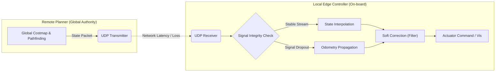

# Robust State Estimation & Remote Control in High-Latency Environments

### : Fault-Tolerant Teleoperation for AMRs using Hybrid Kinematic Prediction

> **Project Status:** Completed (December 2025)  
> **Domain:** Networked Robotics, Teleoperation, State Estimation, Edge Computing  
> **Key Tech:** UDP Communication, Trajectory Smoothing, Dead Reckoning (Odometry Propagation)

 

## Full Research Report

For a detailed analysis of the control stability and error metrics, please refer to the full report below:
[-Click_Here-blue?style=for-the-badge)](./Docs/Research_Report.pdf)

-----

## Abstract

This project implements a **fault-tolerant state estimation framework** for remote-controlled Autonomous Mobile Robots (AMRs) operating under unstable network conditions. Utilizing a high-fidelity physics simulation environment (Unreal Engine), I developed a **custom UDP communication layer** to model real-world constraints such as sensor-to-actuator latency, jitter, and stochastic packet loss.

The core contribution is a **Hybrid Prediction Algorithm** that adaptively switches between **Temporal State Interpolation** and **Kinematic Prediction (Dead Reckoning)** based on data stream integrity. Quantitative experiments demonstrate that the local controller maintains kinematic consistency and operational safety even under **300ms latency** and **61% signal loss**, proving its resilience in distributed robotic control systems.

-----

## Simulation & Validation

The left screen shows the raw sensor feed (discontinuous/stopped), while the right screen shows the locally estimated state (smooth/continuous) using the proposed algorithm.

| **Scenario 1: High Latency (300ms)** | **Scenario 2: Critical Signal Loss (60%+)** |
|:---:|:---:|
| **State Interpolation** ensures smooth trajectory tracking despite severe signal jitter. | **Kinematic Prediction** maintains control loop stability during communication blackouts. |

-----

## System Architecture

The simulation adopts a decoupled **Remote Planner - Local Controller** architecture to simulate a realistic teleoperation scenario where the high-level path planning occurs remotely (e.g., Cloud/Server), and low-level execution occurs on the edge (Robot).

### 1\. Communication Layer (Custom UDP)

Instead of relying on high-level engine replication, a raw BSD-socket-based communication manager was implemented to emulate a **Real-Time Control Protocol**.

  * **Protocol:** Custom binary packet structure (`Header` + `KinematicState` + `Timestamp`).
  * **Environment Modeling:** Programmable **Latency (0-500ms)** and **Packet Loss (0-100%)** injection to simulate degraded radio environments (e.g., WiFi interference, long-range teleoperation).

### 2\. Hybrid State Estimation Algorithm

The local controller employs a Finite State Machine (FSM) to handle incoming state updates and estimate the robot's true position:

  * **Mode A: Trajectory Smoothing (Normal Operation)**
      * Delays execution slightly ($T_{local} = T_{remote} - T_{delay}$) to buffer incoming state packets.
      * Performs linear interpolation to eliminate control oscillation (jitter) caused by variable network latency.
  * **Mode B: Kinematic Prediction (Signal Loss Fallback)**
      * Triggered when the buffer underruns due to packet loss ($Gap > Threshold$).
      * Extrapolates the robot's future state using the last known velocity and heading ($P_{est} = P_{last} + V \times \Delta t$), effectively acting as a software-based **Odometry Propagation**.
  * **Reconciliation:** Uses a **Soft Correction Filter** to smoothly blend the estimated state with the authoritative state upon signal recovery, preventing "teleportation" artifacts (sudden position jumps).

-----

## Experimental Analysis

Experiments were conducted to measure **Tracking Error** and **Motion Continuity** under varying network stress.

### 1\. Robustness: Tracking Error Analysis

**Condition:** Latency 110ms / **Packet Loss 61%**

  * **Observation:** The blue line (Estimated Path) shows occasional deviations when Prediction Mode is active during signal loss.
  * **Analysis:** Crucially, the error **rapidly converges to zero** immediately after the signal is restored. This proves the system's **Resilience**—the local estimator recovers from drift without permanent desynchronization.

### 2\. Availability: Kinematic Consistency

**Condition:** Communication Blackout Intervals

  * **Observation:** The raw signal (Red Dotted) frequently drops to zero velocity, indicating the robot would stop moving due to command loss.
  * **Analysis:** The estimated state (Blue Solid) maintains a velocity profile consistent with the remote planner's intent. This proves **Operational Continuity**—the robot continues to function autonomously based on its internal kinematic model even when the link is down.

-----

## Technology Stack

  * **Simulation Environment:** Unreal Engine 5.4 (Source Build) - *Used as a Physics & Rendering Sandbox*
  * **Language:** C++17 (Strict memory management with Smart Pointers)
  * **Communication:** `FSocket` (Low-level UDP implementation for Real-Time Data)
  * **Control/AI:** Global Path Planning ($A^*$), Navigation Mesh
  * **Analysis Tools:** Python (Pandas, Matplotlib) for telemetry log parsing

-----

## Author

**Dohun Lee**

  * **Affiliation:** DigiPen Institute of Technology (BS in Computer Science)
  * **Focus:** Robotics Middleware, Real-Time Simulation, Embedded Systems
  * **Contact:** vbn9302@gmail.com

-----

## Author

**Dohun Lee**

  * **Affiliation:** DigiPen Institute of Technology (BS in Computer Science in Real-Time Interactive Simualtion)
  * **Contact:** vbn9302@gmail.com
